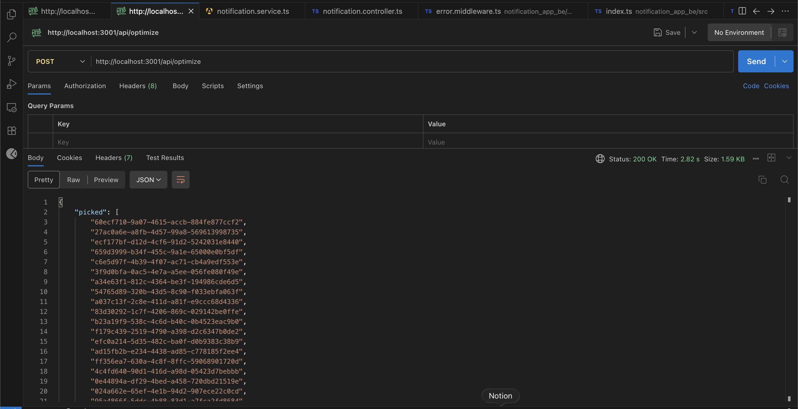
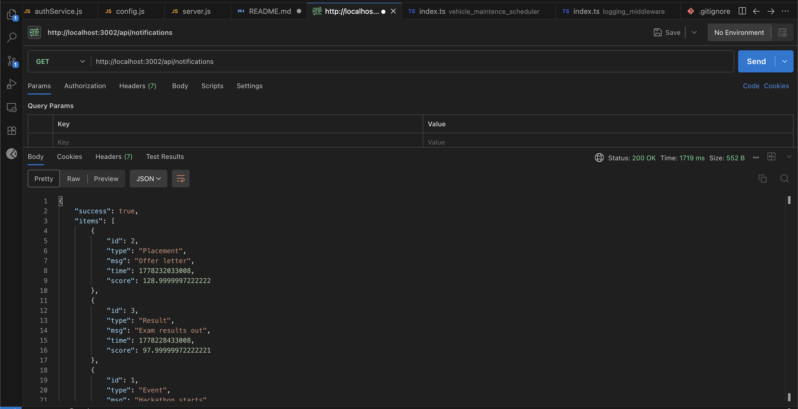

# Backend Evaluation

My submission for the backend track. Contains the scheduler, priority inbox, and logging middleware.

## Setup
Install Node.js.

Start scheduler:
```sh
cd vehicle_maintence_scheduler
npm i
npm start
```

Start notifications:
```sh
cd notification_app_be
npm i
npm start
```

## API Screenshots

